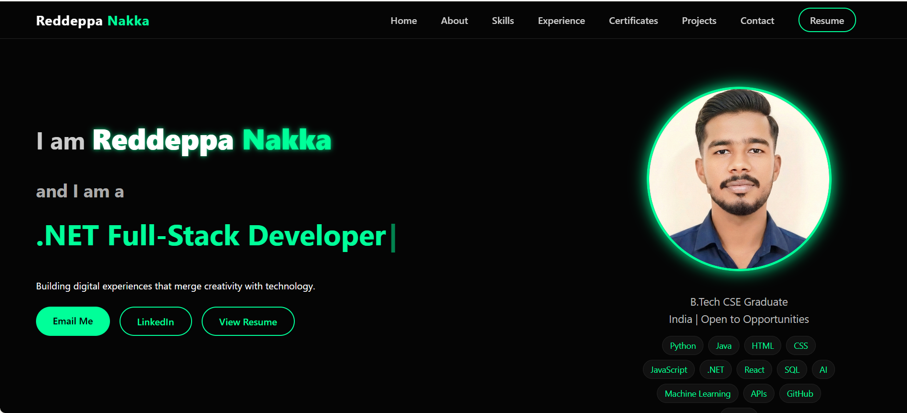
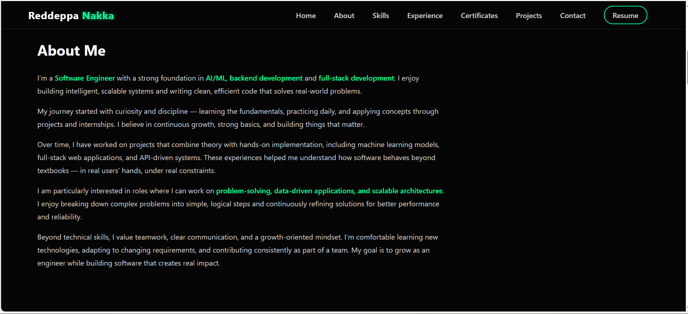
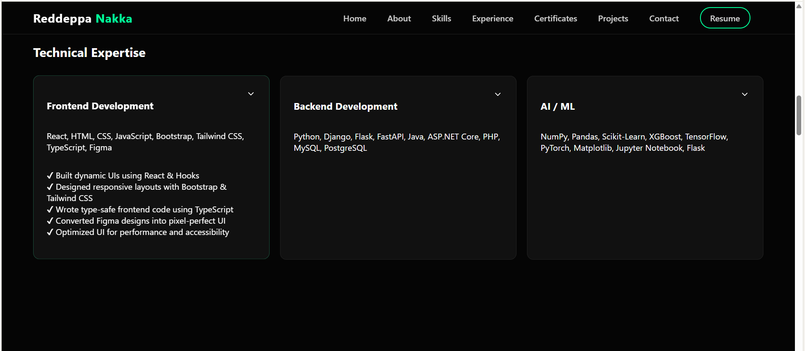
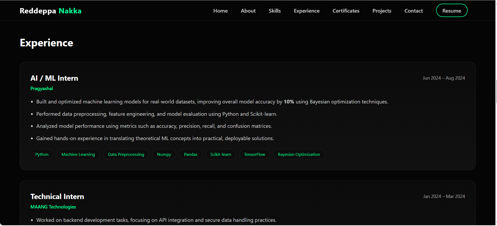
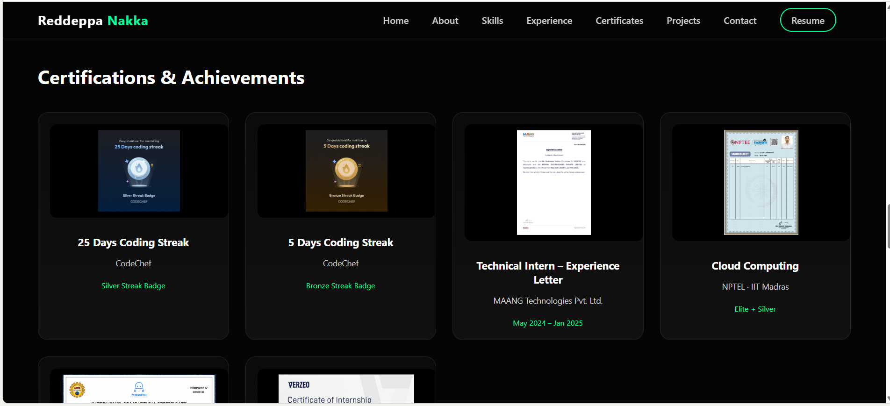
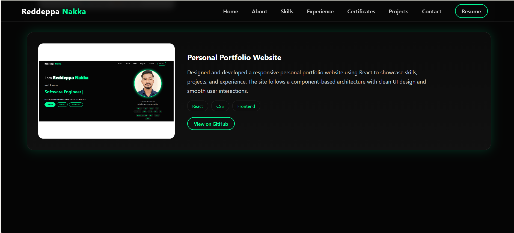
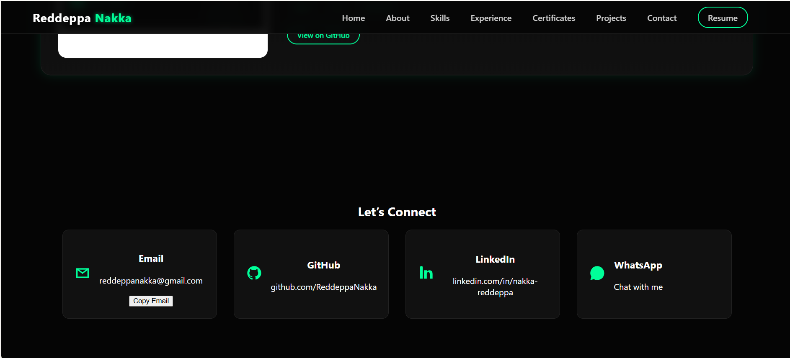

# 🌐 My Portfolio Website

This is my personal portfolio website showcasing my projects, skills, certifications, and experience as a Computer Science Engineering student.

## ✨ Features
- Responsive and modern UI
- Dedicated sections for Projects, Skills, Experience, and Certifications
- Smooth navigation and clean layout

## 🛠️ Tech Stack
- React
- JavaScript
- HTML5
- CSS3

## 📸 Screenshots

### 🏠 Home

### 🙋 About

### 🛠️ Skills

### 💼 Experience

### 📜 Certifications

### 🚀 Projects

### 📬 Contact

## 🚀 Live Demo
(Deployment link coming soon)

## 👤 Author
**Reddeppa Nakka**  
GitHub: https://github.com/ReddeppaNakka
