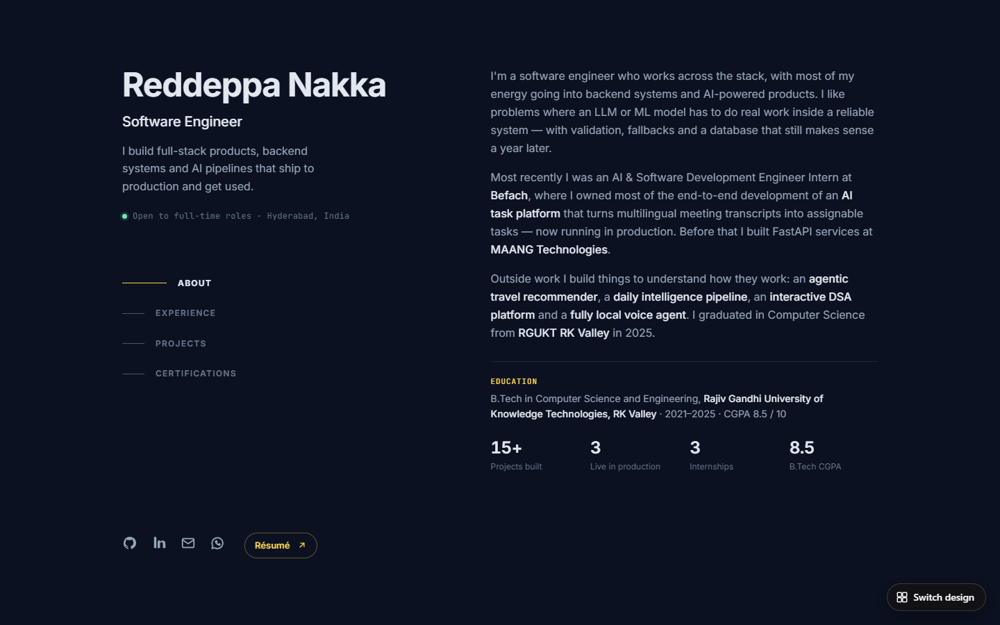
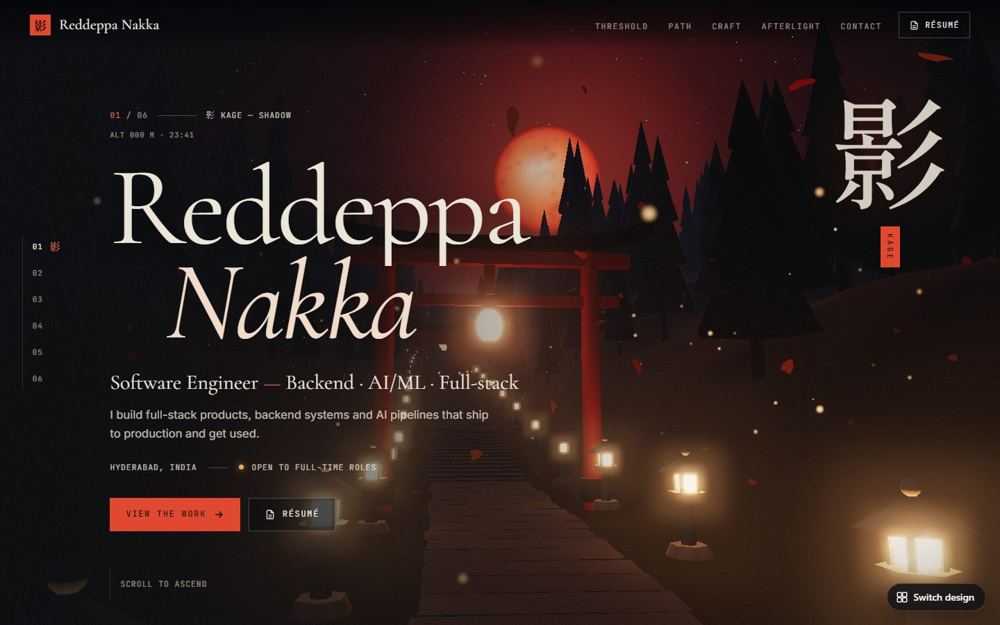
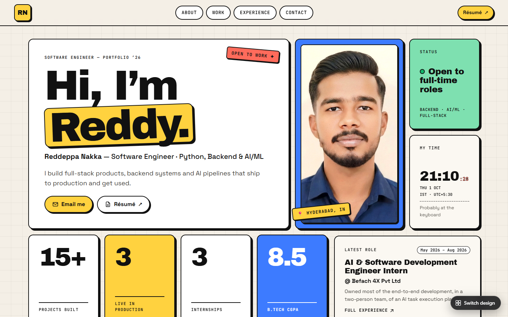
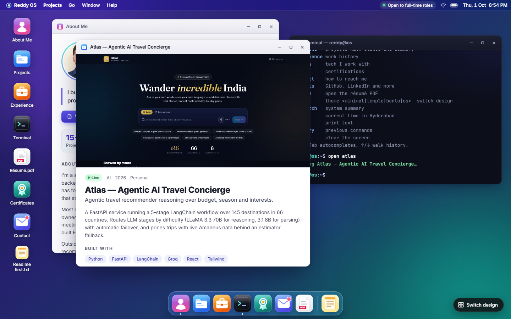
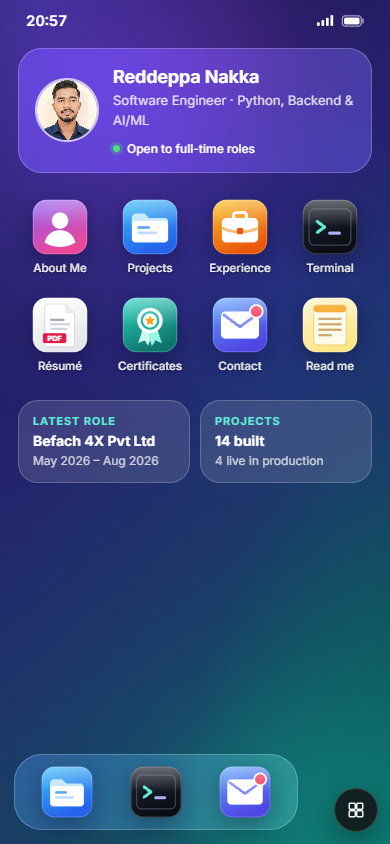
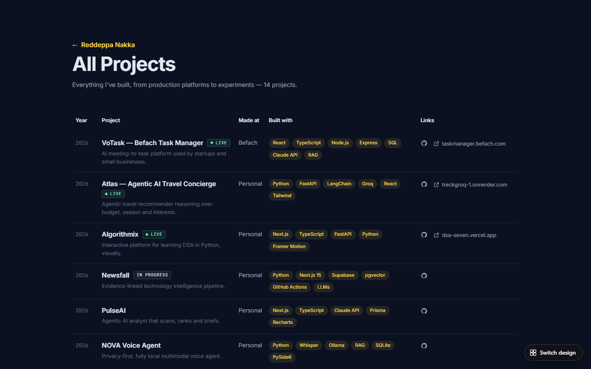

# Reddeppa Nakka — Portfolio

One portfolio, four complete designs. The same content is rendered by four independent themes, and visitors can switch between them live with the **Switch design** button (bottom-right). The choice is remembered and shareable as a link.

👉 **[View it live](https://reddeppa-portfolio.netlify.app/)**

| Design | Link | What it shows off |
|---|---|---|
| **Minimal** (default) | [`?theme=minimal`](https://reddeppa-portfolio.netlify.app/?theme=minimal) | Recruiter-first two-column layout, scroll-spy nav, cursor spotlight, full project archive table |
| **Night Temple** | [`?theme=temple`](https://reddeppa-portfolio.netlify.app/?theme=temple) | Scroll-driven Three.js world built entirely in code — camera path, lanterns, fog, bloom, adaptive quality |
| **Bento** | [`?theme=bento`](https://reddeppa-portfolio.netlify.app/?theme=bento) | Neo-brutalist bento grid, live clock, animated project filtering, pointer tilt |
| **Reddy OS** | [`?theme=os`](https://reddeppa-portfolio.netlify.app/?theme=os) | Desktop OS with a window manager (drag, resize, minimise), dock, file browser and a working terminal; phone home screen on mobile |

## Screenshots

### Minimal


### Night Temple


### Bento


### Reddy OS


<p>
  
</p>

### Project archive


## How it's built

- **React 19 + Vite**, plain CSS (no UI framework), React Router for `/archive`.
- **One content file** — [`src/data/portfolio.js`](src/data/portfolio.js) holds the profile, experience, projects, skills and certifications. Every design reads from it, so adding a project is a single edit.
- **Code-split themes** — each design in [`src/themes/`](src/themes/) is its own lazily loaded chunk; the 3D scene loads only when Night Temple is opened.
- **Scoped styles** — every theme's CSS lives under its own root class, so switching never leaks styles.
- **Three.js + GSAP** for the Night Temple scene and scroll choreography; the scene steps down its quality (no bloom → lower resolution → painted fallback) on devices that can't keep up.
- Responsive from 360px up, keyboard accessible, and respects `prefers-reduced-motion`.

```
src/
  data/portfolio.js      content for every design
  shell/                 theme registry, switcher, shared icons and hooks
  themes/
    minimal/  temple/  bento/  os/
```

## Run locally

```bash
npm install
npm run dev       # http://localhost:5173
npm run build     # production build in dist/
```

Deployed on Netlify (`netlify.toml` sets the build command and `dist` folder).

## Credits

Minimal layout inspired by [Brittany Chiang](https://brittanychiang.com/); Night Temple inspired by Meng To's [Kage](https://github.com/MengTo/kage). All code and visuals here are original.

## Author

**Reddeppa Nakka** — [GitHub](https://github.com/ReddeppaNakka) · [LinkedIn](https://www.linkedin.com/in/reddeppa-nakka/) · reddeppanakka@gmail.com
